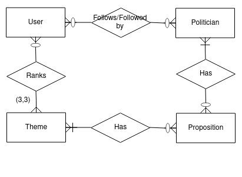

### ERD

### Access patterns

- :dart: Main
  - [x] Create user
  - [x] Find user
  - [x] Rank 3 favorite themes
  - [ ] Create theme
  - [x] List themes
  - [X] Find theme and list its newest propositions
  - [ ] [Needs processing]Find theme and list its politicians ordered by relevance in theme
    - Most propositions overall
  - [x] Show rank stat of theme
    - Most relevant themes among users (show a #1/2/3 by the theme name)
  - [ ] Create proposition
  - [x] Find proposition and list its authors
  - [ ] Create politician
  - [ ] Show follow count of politician
  - [ ] Find politician and list its newest propositions
  - [ ] Watch politician
    - Notify user of every new proposition by this politician
- :star: Extras
  - [ ] Watch themes
    - Notify user of every new proposition in this theme
  - [ ] Find theme and list its politicians ordered by relevance in theme
    - Most contributions by period (last `x` years)

### Dynamodb Entity chart

| Entity | PK | SK |
| :------------ |:--------------| :-----|
| User      | USER#\<Username> | USER#\<Username> |
| Politician | POLITICIAN#\<PoliticianName>      | POLITICIAN#\<PoliticianName> |
| Proposition | PROPOSITION#\<PropositionName>      | PROPOSITION#\<PropositionName> |
| PropositionTheme | PROPOSITION#\<PropositionName>      | #THEME#\<ThemeName> |
| PropositionAuthor | PROPOSITION#\<PropositionName>      | AUTHOR#\<AuthorName> |
| PoliticianFollow | USER#\<UserName>POLITICIAN#\<PoliticianName>      | USER#\<UserName>POLITICIAN#\<PoliticianName> |
| Themes | THEMES      | THEMES |
| Theme | THEME#\<ThemeName>      | THEME#\<ThemeName> |

| Entity | GSI1PK | GSI1SK |
| :------------ |:--------------| :-----|
|AuthorPropositions | AUTHOR#\<AuthorName>| PROPOSITION#\<PropositionName>|
|ThemePropositions | THEME#\<ThemeName>| PROPOSITION#\<PropositionName>|

<!-- | Entity | GSI2PK | GSI2SK |
| :------------ |:--------------| :-----| -->